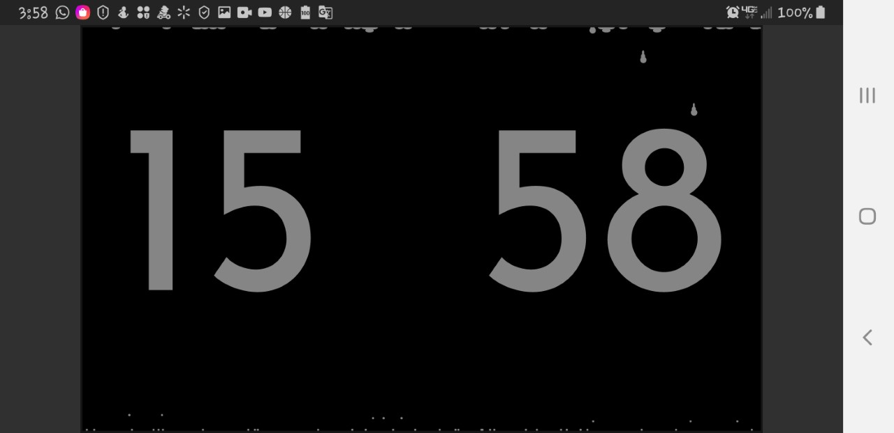
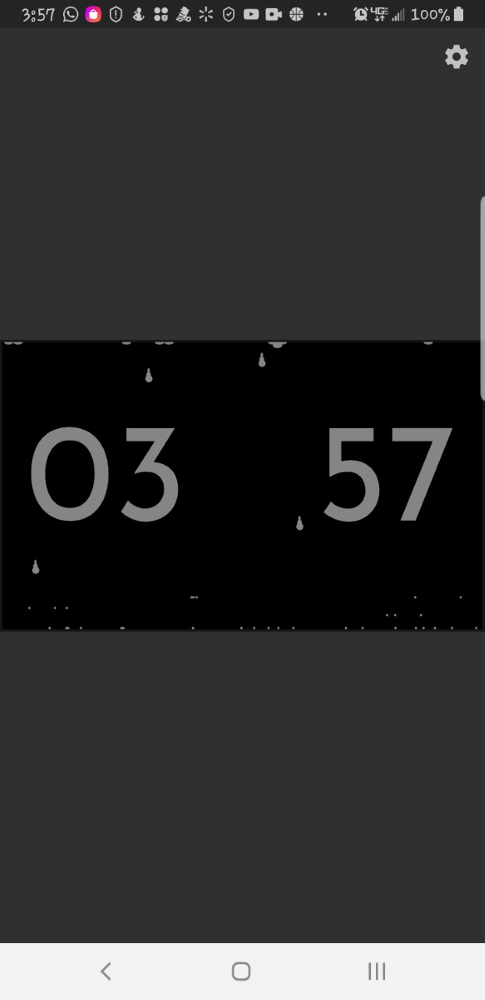
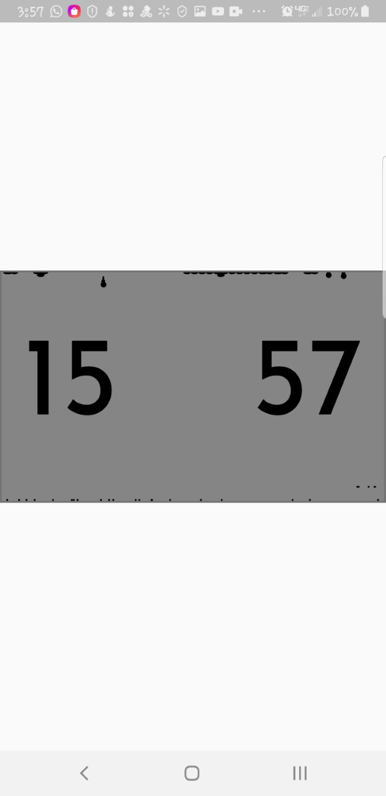
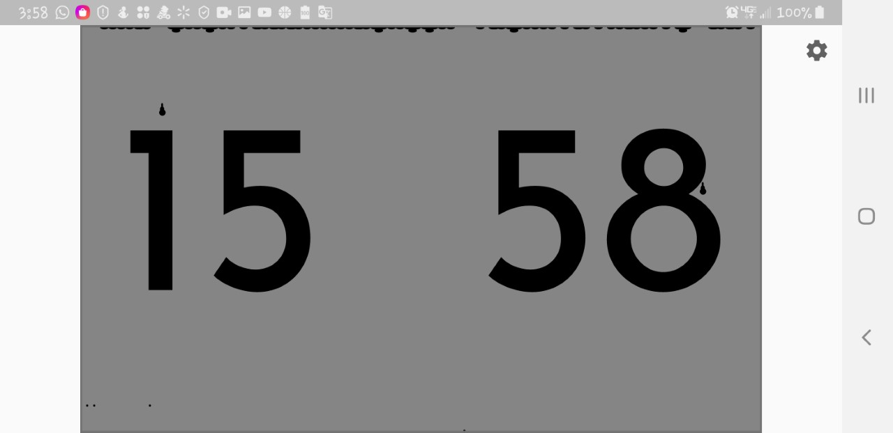

# waterdrop-clock

I have made this cool Waterdrop clock face for Google's Flutter Clock compitition.

this is my first flutter project I have ever created. I have taken  my go to "hello world" like project, which happens to be a water drop animation. I have merged it with a clock face and built it to meet the compititions expectations.

It is very simple. 

I have taken my previous animation and built it into flutter using the CustomPainter.
The canvas draws every Tick of the render.

At first I struggled to fin and "Endless" animation widget. All animations in flutter tend to have a beginning and and end. I wanted mine to generate dynamically forever! I figure out how to do this with the Ticker class which gives me access to a method that is called 60 frames per second and this allowed me to do endless animations on a canvas. I wanted to do collision detections with the clock text, but this has proven difficult as I can not figure out how to access the pixel color of individual pixels on the canvas.

here are some screenshots :)

